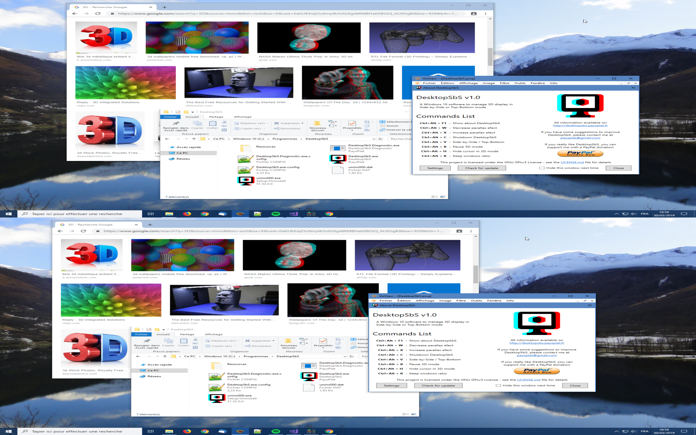

# DesktopSbS

## Warning

 DesktopSbS needs **Windows 10 Creators Update** to work well.  
You can download it manually if you do not want to wait Windows Update deployment.  
[Windows 10 Creators Update](https://www.microsoft.com/en-us/software-download/windows10)

## Download latest version

**2020-11-05: DesktopSbS v1.2 [(Changelog)](#versions)**

 **[DesktopSbS_v1.2_Setup.exe](https://github.com/PaysPlat/DesktopSbS/releases/download/v1.2/DesktopSbS_v1.2_Setup.exe)**

## Introduction

I have (not so) recently bought a new video projector. It handles 3D from computer in Side-by-Side and Top-Bottom mode and it is awesome for 3D content.

But PC Windows 10 interface is really impossible to use.

### Windows 10 interface on 3D device

So I decided to develop a software able to manage 3D display of desktop in Side-by-Side or Top-Bottom mode. And I called it **DesktopSbS**

## ScreenShots

Here are two screenshots of DesktopSbS rendering.

They seems strange but they look fine on a 3D device.

### DesktopSbS in Side-by-Side mode

### DesktopSbS in Top-Bottom mode

## Acronyms

SbS = Side-by-Side

TB  = Top-Bottom

DWM = Desktop Window Manager

## Getting Started

### Prerequisites

DesktopSbS has been developped for Windows 10 and it works correctly from **[Windows 10 Creators Update](https://www.microsoft.com/en-us/software-download/windows10)**.  
It should work with any hardware configuration able to run Windows 10.

DesktopSbS rendering uses Windows DWM (**Desktop Window Manager**), the built-in application for thumbnails so rendering is really performant and has a low CPU consumption.

### Installing

You can download the latest version setup and run it.

You can change install folder, start menu location and add a desktop icon, as usual in a setup wizard.

### First launch

At first launch, DesktopSbS will display its about window with commands shortcuts and other information.

The default commands shortcuts are:

- **Ctrl + Alt + F1** : show about DesktopSbS
- **Ctrl + Alt + W** : decrease parallax efect
- **Ctrl + Alt + X** : increase parallax efect
- **Ctrl + Alt + C** : Shutdown DesktopSbS
- **Ctrl + Alt + V** : Switch Side-by-Side to Top-Bottom
- **Ctrl + Alt + B** : Pause 3D mode
- **Ctrl + Alt + H** : Hide cursor in 3D mode
- **Ctrl + Alt + K** : Keep windows ratio

Shortcuts are configurable in settings window.

## Features

### Versions

**- 2020-11-05: [DesktopSbS_v1.2_Setup](https://github.com/PaysPlat/DesktopSbS/releases/download/v1.2/DesktopSbS_v1.2_Setup.exe)**

- fix crashes at startup

**- 2020-07-21: [DesktopSbS_v1.1_Setup](https://github.com/PaysPlat/DesktopSbS/releases/download/v1.1/DesktopSbS_v1.1_Setup.exe)**

- Exception logger

**- 2019-03-30: [DesktopSbS_v1.0_Setup](https://github.com/PaysPlat/DesktopSbS/releases/download/v1.0/DesktopSbS_v1.0_Setup.exe)**

- Source and destination screens can be different
- A custom area of source screen can be defined
- Shortcuts are now configurable
- All settings are editable in settings window
- Automatic or manual check for updates
- Integration of diagnostic application
- bugfixes

**- 2018-09-03: [DesktopSbS_v0.5_Setup](https://github.com/PaysPlat/DesktopSbS/releases/download/v0.5/DesktopSbS_v0.5_Setup.exe)**

- Add option to hide cursor in SbS mode
- Add option to preserve windows ratio in SbS mode

**- 2018-01-22: [DesktopSbS_v0.4_Setup](https://github.com/PaysPlat/DesktopSbS/releases/download/v0.4/DesktopSbS_v0.4_Setup.exe)**

- Bugfix : Activation of SbS mouse cursor only on active screen

**- 2018-01-19: [DesktopSbS_v0.3_Setup](https://github.com/PaysPlat/DesktopSbS/releases/download/v0.3/DesktopSbS_v0.3_Setup.exe)**

- Secondary screen management

**- 2017-05-11: [DesktopSbS_v0.2_Setup](https://github.com/PaysPlat/DesktopSbS/releases/download/v0.2/DesktopSbS_v0.2_Setup.exe)**

- Management of Metro Windows (Windows Store, Parameters,...)
- Warning at start if Windows version is older than Creators Update
- Improvement of taskbar rendering

**- 2017-04-26: [DesktopSbS_v0.1_Setup](https://github.com/PaysPlat/DesktopSbS/releases/download/v0.1/DesktopSbS_v0.1_Setup.exe)**

- SbS / TB rendering for all windows.
- SbS / TB rendering of Windows taskbar (standard location)
- Configurable parallax effect (the topest windows seem nearer)
- SbS / TB management of mouse cursor (hide Windows cursor and display two resized)
- Management of display scales different of 100%
- Excluded fullScreen applications, DesktopSbS can pause itself for some applications, useful if other application already manage Side-by-Side display, for example a SbS video player.

### What could be improved

- Sometimes a window goes up DesktopSbS rendering
- Sometimes Windows taskbar goes up DesktopSbs rendering
- Add of a notification icon

### What is not working (not yet or never)

- Windows start menu rendering
- Windows applications switch rendering (Alt + Tab)

## Legal information

### Authors

**PaysPlat** [paysplat@gmail.com](mailto:paysplat@gmail.com)

### Warranty

DesktopSbS is provided without any warranty.

I will not be responsible for any damage made on your computer.

Keep always a fire extinguisher near of you.

### Pricing

DesktopSbS is **free** and open-source.
You can download, install and run it without paying.

If you like it, you can still support me with a PayPal donation.

### License

This project is licensed under the GNU GPLv3 License - see the [LICENSE.md](LICENSE.md) file for details
